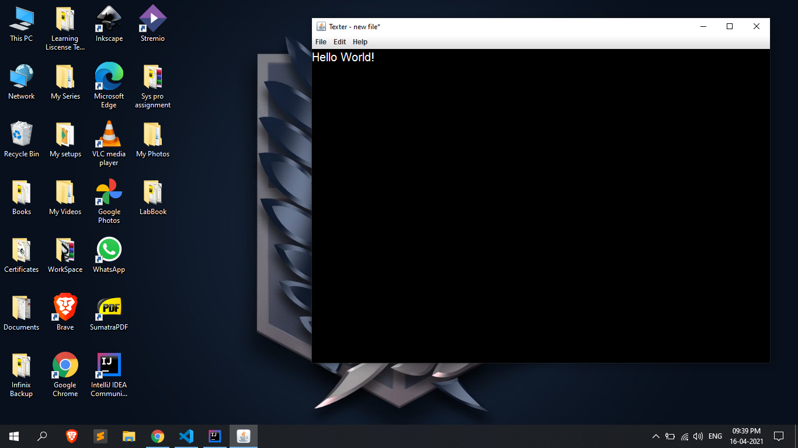
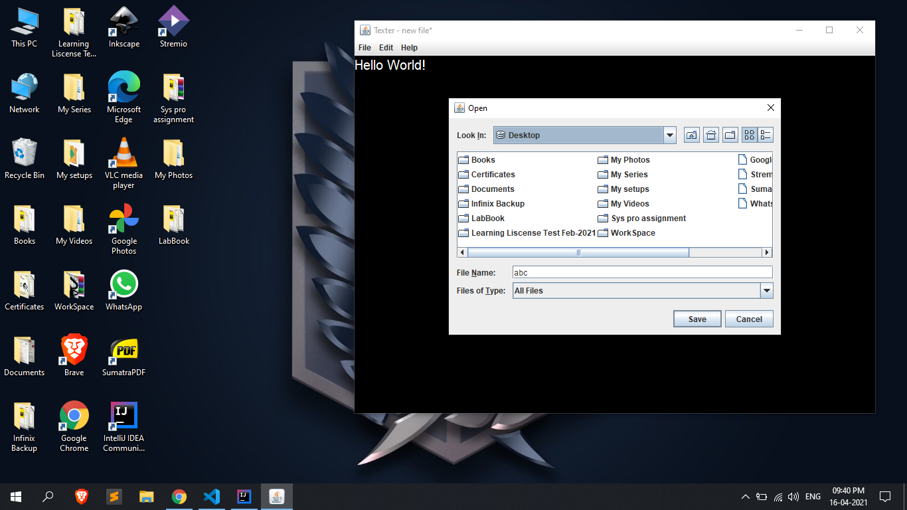
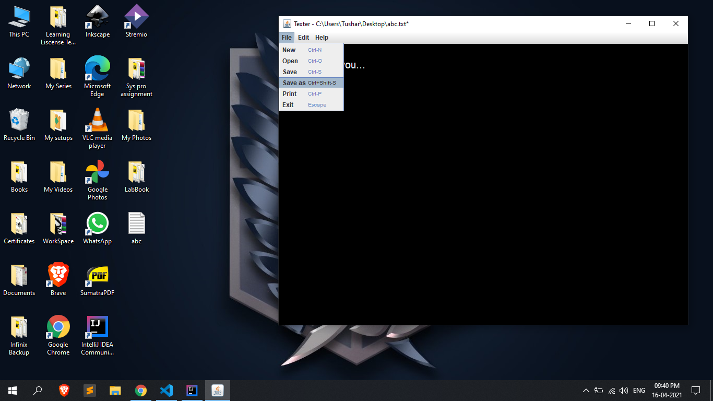
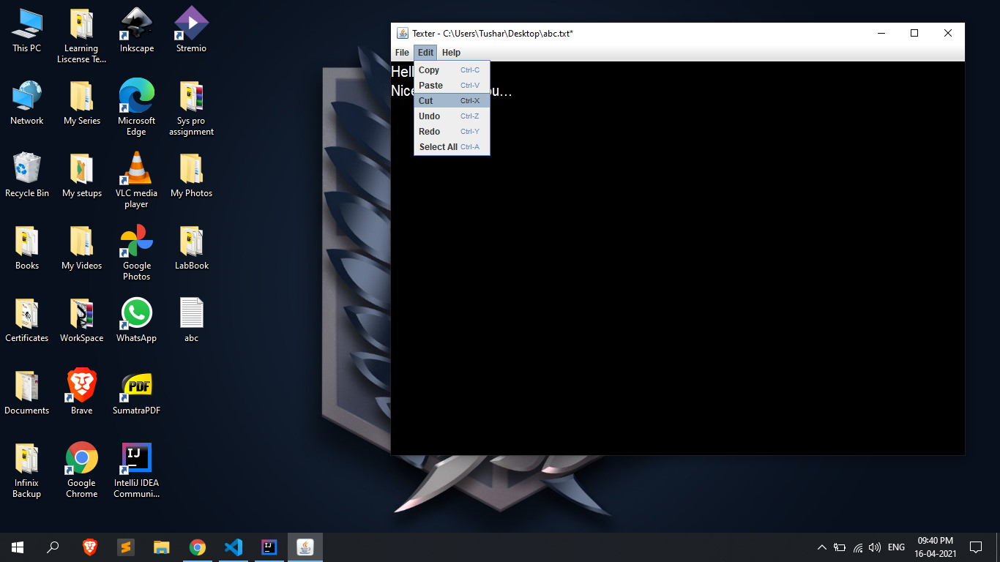

# Texter-Text-Editor
Texter is a cross-platformed light-weight text editor written in Java. 

This text editor is written for learning purpose only. Hence it is still buggy. It is pretty similar to Windows notepad. I tried to keep the code pretty simple and understandable.

# Features
1) Open file.
2) Save / Save as.
3) Print.
4) Cut/Copy/Paste.
5) Undo/Redo.

# Upcoming Features
1) Find and replace.
2) Font and color settings.

# Screenshots
<<<<<<< HEAD

=======
.png)
.png)
.png)
>>>>>>> 0f430bcf758b7ebba7ef6d4a250143366987e5e5

# Installation
1) Build the jar file using any Java IDE.
2) Use executable wrapper like <a target="_Blank" href="http://launch4j.sourceforge.net/">Launch4j</a>
